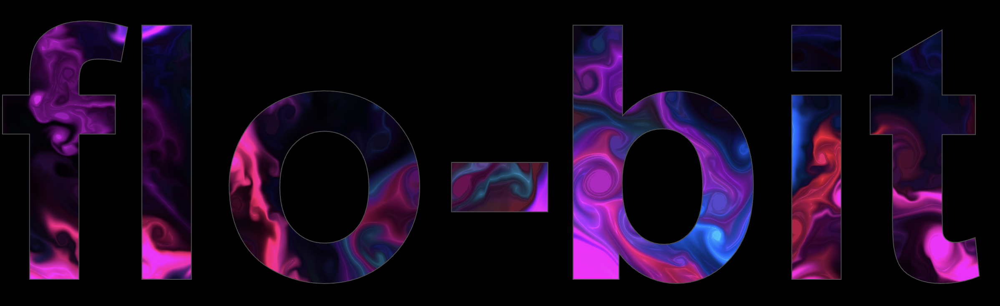
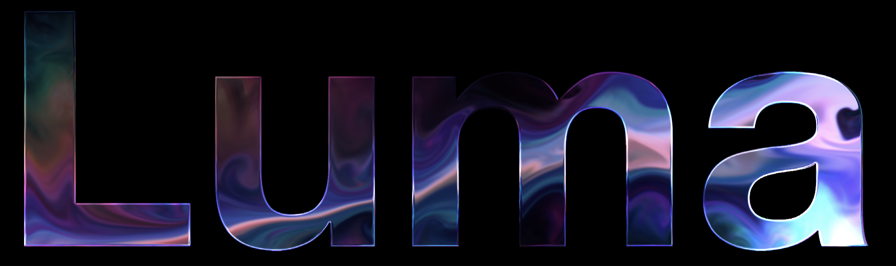

# Text effect: Fluid Simulation demo

[Live demo](https://flo-bit.github.io/text_effect_fluid/) (currently sometimes breaks on first open, just reload once or twice)

[](https://flo-bit.github.io/text_effect_fluid/)

Inspired by the current (Jan 2024) version of [the lumalabs homepage](https://lumalabs.ai/) (obviously, their effect looks *way* better, than my quick and dirty version):



Adjusted version of this awesome [WebGL Fluid Simulation](https://github.com/PavelDoGreat/WebGL-Fluid-Simulation).

## How it works

I wrote a short [blog post](https://flobit.substack.com/p/how-i-recreated-this-awesome-text) about my approach.

## Usage

- Add `script.js` and `LDR_LLL1_0.png` to your project

- Add this to your html

```html
<div id="canvasContainer">
    <canvas></canvas>
    <canvas id="maskCanvas"> </canvas>
</div>

<script src="./script.js"></script>
```

- Add this styling

```css
html,
body {
    overflow: hidden;
    background-color: #000;
}

body {
    margin: 0;
}

#canvasContainer {
    position: relative;
    width: 100vw;
    height: 100vh;
}

canvas {
    width: 100%;
    height: 100%;
    position: absolute;
}
```


## License

MIT License

```
Copyright 2024 flo-bit

Permission is hereby granted, free of charge, to any person obtaining a copy of this software and associated documentation files (the “Software”), to deal in the Software without restriction, including without limitation the rights to use, copy, modify, merge, publish, distribute, sublicense, and/or sell copies of the Software, and to permit persons to whom the Software is furnished to do so, subject to the following conditions:

The above copyright notice and this permission notice shall be included in all copies or substantial portions of the Software.

THE SOFTWARE IS PROVIDED “AS IS”, WITHOUT WARRANTY OF ANY KIND, EXPRESS OR IMPLIED, INCLUDING BUT NOT LIMITED TO THE WARRANTIES OF MERCHANTABILITY, FITNESS FOR A PARTICULAR PURPOSE AND NONINFRINGEMENT. IN NO EVENT SHALL THE AUTHORS OR COPYRIGHT HOLDERS BE LIABLE FOR ANY CLAIM, DAMAGES OR OTHER LIABILITY, WHETHER IN AN ACTION OF CONTRACT, TORT OR OTHERWISE, ARISING FROM, OUT OF OR IN CONNECTION WITH THE SOFTWARE OR THE USE OR OTHER DEALINGS IN THE SOFTWARE.
```